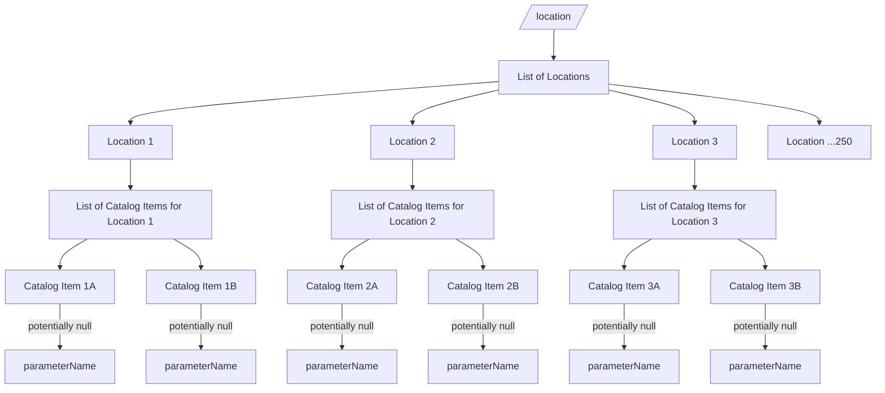

# Edr Mappings Overview

In order for an endpoint to implement EDR, it needs to implement multiple query types. The main challenge is that the current output format of RISE requires joining data across multiple API queries to complete the EDR query.

> Note: In this investigation I have been focused primarily on items , locations, area, and cube queries.

## Locations Query as an Example EDR Mapping Challenge

To query locations in RISE we use the `/location` endpoint. The `/location` endpoint returns a list of locations. However it does not contain all the info we need to implement the EDR query. 

- The EDR spec expects a location query to be able to be filtered by`parameter-name` 
    - Thus, we need to get the list of the parameters associated with each location. 
        - parameter names are defined within the `/catalog-item` endpoint
    - We can only get this by fetching the catalog item associated with each location
    - As the result we end up needing to fetch every single catalog item in order to get the list of parameters for each location
        - This is roughly 250 queries

_`/location` returns a list of locations. Each location returns a list of catalog items. Each catalog item is associated with one `parameterName` which can be potentially null._

**How to filter a location by a parameter**
1. Query `/location`
2. Send ~250 independent fetch calls; one to each catalog item
3. Block until the last fetch returns
    > NOTE: If one fetch doesn't return, the query is incomplete
4. Filter the `/location` response by the passed in `parameter-name`

## Other Challenges

## Optimization Options

In order to implement EDR within the current schema of the RISE API, we need to join data across API and points. However during the process of fetching that data most queries are independent.  Thus, there are options for optimization

- Fetch dependent data in parallel using `async`. 
    - Baseline optimization needed for queries to be usable. 
    - Requires lots of data to be fetched unnecessarily.
- Cache the dependent data
    - Greatly reduces latency but adds complexity regarding when to invalidate the local cache with the new upstream data.
- Change the underlying API to Out put additional data needed for EDR queries
    - This should not require taking anything away, but it may cause the API to output duplicate data or deviate from the current patterns. 

