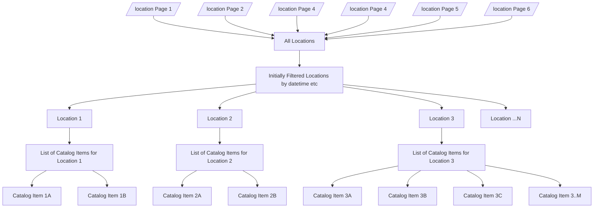

# EDR Mappings Overview


In order for an endpoint to implement EDR, it needs to implement multiple query types. The main challenge is that the current output format of RISE requires joining data across multiple API calls to complete the EDR query.

> Note: In this document I am primarily focused on location queries. However, we will also want to implement other query types, probably at least locations, items, area, and cube. 
> 
> The challenges mapping RISE location queries into EDR are similar to the challenges with other types of queries. 

## Locations Query as an Example EDR Mapping Challenge

To query locations in RISE we use the `/location` endpoint. 

- The `/location` endpoint returns a list of locations.
- `/location` is paginated. 
    - Each page maxes out at 100 items.
    - There are 592 items so we need to fetch 6 times to get all of them before starting to filter.
    - If one call fails, the call is incomplete since we don't have a location

`/location`, even after merging all pages, does not contain all the info we need to implement the EDR query. 

- The EDR spec expects a location query to be able to be filtered by a `parameter-name` 
    - Thus, we need to get the list of the parameters associated with each location. 
        - parameter names are defined within the `/catalog-item` endpoint
    - We can only get this by fetching the catalog item associated with each location
    - As the result we end up needing to fetch every single catalog item in order to get the list of parameters for each location

_`/location` returns a list of locations. Each location returns a list of catalog items. Each catalog item is associated with one `parameterName` which can be potentially null._



**How to construct an EDR location query with a `parameter-name` filter**

1. Query each page in `/location`
    - We can fetch only 100 items at a time.
    - We need to do 6 fetches in parallel to get all 592 locations.
    - Block until the last fetch returns
2. Join all the `/location` paginated responses into one JSON
3. Send parallel fetch calls to each catalog item
4. Block until the last fetch returns
    > NOTE: If one fetch doesn't return, the query is incomplete
5. Filter the `/location` response by the passed in `parameter-name`

    
## Location Query Time Complexity

Each location query that requires a parameter filter usually ends up being ~6s, but sometimes there is unexpected [latency](#latency). In summary it requires:

- ~3s to fetch and merge all the `/location` paginated responses and block until the last one is finished
- ~3s to fetch and merge all the `/catalog-item` responses and block until the last one is finished
- 3s + 3s = ~6s in total to resolve the query 
    - (best case assuming little latency server-side)

Since our fetches are in parallel the biggest time complexity addition comes from the fact we need to fetch in a group then block to merge the responses. Since each group is fetched in parallel, the complexity is not made worse by the number of pages or catalog items (assuming no addition latency server-side).

## Other Challenges

## High number of requests

In order to complete a query, we need to fetch all the pages of an endpoint. Only once we have all the pages can we resolve the query. Then once we merge the pages, if we are missing parameters, we need to fetch additional info from an endpoint like `/catalog-item`

There are `6973` catalog items. In the worst case, if every one is associated with a location and the user does not apply other filters, we need to fetch all of them in order to determine which parameter is associated with each location.

If one fetch fails, the query is incomplete since we do not have all the information needed. 

Without caching this ends up adding significant load to the server. 

### Error handling

Sometimes the API will return an internal server error without a description of what occured. This can be replicated by running the tests which query the following catalog items. The other catalog items return without issue.

If we are fetching multiple catalog items, then the query is incomplete and fails even if one fails.

```json
    "https://data.usbr.gov/rise/api/catalog-item/11007": {
        "type": "https://tools.ietf.org/html/rfc2616#section-10",
        "title": "An error occurred",
        "detail": "Internal Server Error"
    },
    "https://data.usbr.gov/rise/api/catalog-item/11013": {
        "type": "https://tools.ietf.org/html/rfc2616#section-10",
        "title": "An error occurred",
        "detail": "Internal Server Error"
    },
    "https://data.usbr.gov/rise/api/catalog-item/11050": {
        "type": "https://tools.ietf.org/html/rfc2616#section-10",
        "title": "An error occurred",
        "detail": "Internal Server Error"
    }
```

> Note: there was a previous issue where the API output data saying it was down for maintenace. However, this is no longer able to be reproduced. The following error arose starting around August 4.

### Latency

Latency is variable and not well defined without caching. In [the query statistics script](./location_query_statistics.py) the latency to complete a parameter-query varies between `[5.935041666030884, 3.5702786445617676, 3.530980348587036, 36.61881160736084, 6.0607383251190186, 19.794275283813477]`. This is significant variability.

Caching would reduce this but add more complexity.

### Joining multiple API calls deep

So far I have not encountered any EDR queries that require fetching json twice. i.e. `fetch json -> get key -> fetch json -> get key` chaining.

However, if we have to supported nested joins like this it adds complexlity with error handling. Each fetch we need to do requires us to block until the group of URLs are all fetched.

## Optimization Options

In order to implement EDR within the current schema of the RISE API, we need to join data across API endpoints. However during the process of fetching that data, most queries are independent.  Thus, there are options for optimization

- Fetch data needed for joins in parallel using `async`. 
    - This is the **baseline optimization described above** that is needed for queries to be usable.
    - This is easy to implement on our end, but not great for backend server performance to send so many requests all at once.
- Cache the dependent data
    - Greatly reduces latency but adds complexity regarding when to invalidate the local cache with the new upstream data.
    - There will be a significant UX difference to the user between queries which are cached and those which are not. 
- Change the underlying API to output additional data needed for EDR queries
    - This should not require taking anything away, but it may cause the API to output duplicate data or deviate from the current patterns. 


