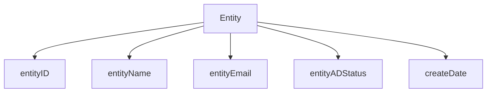

```mermaid
graph TD;
    Catalog --> recordTitle;
    Catalog --> recordDescription;
    Catalog --> dataOwnership;
    Catalog --> ownerID;
    Catalog --> managerID;
    Catalog --> contactID;
    Catalog --> locationID;
    Catalog --> catalogStatusID;
    Catalog --> generationEffortID;
    Catalog --> catalogThemeID;
    Catalog --> subThemeID;
    Catalog --> catalogTagID;
    Catalog --> metadataFilePath;
    Catalog --> metadataStandard;
    Catalog --> authoredByUID;
    Catalog --> lastEditedByUID;
    Catalog --> createDate;
    Catalog --> updateDate; 
```

```mermaid
graph TD
    A[Item] -->|contains| B[itemID]
    A -->|contains| C[catalogID]
    A -->|contains| D[itemStructureID]
    A -->|contains| E[itemTitle]
    A -->|contains| F[itemDescription]
    A -->|contains| G[itemType]
    A -->|contains| H[itemFileFormatID]
    A -->|contains| I[metdataFilePath]
    A -->|contains| J[itemRecordStatusID]
    A -->|contains| K[itemStatusID]
    A -->|contains| L[modelNameID]
    A -->|contains| M[modelNameSourceCode]
    A -->|contains| N[isModeled]
    A -->|contains| O[matrixID]
    A -->|contains| P[accessConstraint]
    A -->|contains| Q[binaryFilePath]
    A -->|contains| R[updateFrequencyID]
    A -->|contains| S[disclaimerID]
    A -->|contains| T[relatedItems]
    A -->|contains| U[temporalParameterID]
    A -->|contains| V[sourceCode]
    A -->|contains| W[locationSourceCode]
    A -->|contains| X[parameterSourceCode]
    A -->|contains| Y[temporalStartDate]
    A -->|contains| Z[temporalEndDate]
    A -->|contains| AA[spatialShortDescription]
    A -->|contains| AB[spatialGeometryID]
    A -->|contains| AC[spatialResolutionID]
    A -->|contains| AD[spatialTransformationID]
    A -->|contains| AE[spatialOpenDataURL]
    A -->|contains| AF[publicationAuthor]
    A -->|contains| AG[publicationEditor]
    A -->|contains| AH[publicationPublisher]
    A -->|contains| AI[publicationPublisherLocation]
    A -->|contains| AJ[publicationFirstPublicationDate]
    A -->|contains| AK[publicationPeriodicalName]
    A -->|contains| AL[publicationSerialNumber]
    A -->|contains| AM[publicationDOI]
    A -->|contains| AN[publicationVolume]
    A -->|contains| AO[publicationIssue]
    A -->|contains| AP[publicationSection]
    A -->|contains| AQ[publicationStartPage]
    A -->|contains| AR[publicationEndPage]
    A -->|contains| AS[authoredByUID]
    A -->|contains| AT[lastEditedByUID]
    A -->|contains| AU[createDate]
    A -->|contains| AV[updateDate]
```

```mermaid
graph TD;
    Entity[Entity] --> entityID[entityID]
    Entity --> entityName[entityName]
    Entity --> entityEmail[entityEmail]
    Entity --> entityADStatus[entityADStatus]
    Entity --> createDate[createDate]
``` 